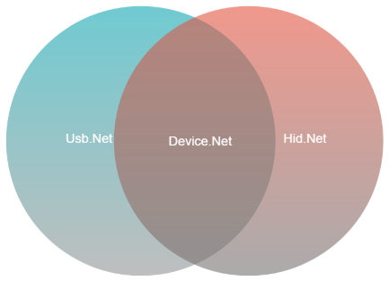

# Device.Net



**Cross-platform .NET framework for talking to connected devices such as USB, Serial Port, and Hid devices uniformly through dependency injection.**

This framework provides a common task-based Async interface across platforms and device types. This allows for dependency injection to use different types of devices on any platform with the same code. The supported device types are Hid, Serial Port, and USB. We will add Bluetooth in the future, and we are looking for Bluetooth programmers to help. Please join the community on Discord [here](https://discord.gg/ZcvXARm).

## Hid.Net
This is a cross-platform library for talking to HID devices. The library targets .NET and UWP.

## Usb.Net
This is a cross-platform library for talking to USB devices. The library targets .NET, Android, and UWP.

## SerialPort.Net
This is a .NET library for talking to Serial Port / COM devices on Windows. We are looking to expand this library to other platforms soon.

## Device.Net.LibUsb
This is a macOS, Windows, and Linux library for talking to USB devices. This uses the library [LibUsbDotNet](https://github.com/LibUsbDotNet/LibUsbDotNet) to bridge with Device.Net. This is an underdeveloped library, and we are looking to replace this with native Linux and macOS API calls. Please reach out if you can help.

### Currently supports:

| Platform | Device Types |
| ------------- |:-------------:|
| .NET Framework     | Hid, USB, Serial Port |
| .NET Core / .NET 5     | Hid, USB, Serial Port  |
| Android* | Hid, USB |
| UWP | Hid, USB   |
| Linux, MacOS* | [USB (Via LibUsbDotNet)](https://github.com/MelbourneDeveloper/Device.Net/wiki/Linux-and-MacOS-Support)  |

_Note: Android treats Hid devices and USB devices as the same thing_

## Hid Example

This sample connects to a thermometer device and then continuously polls for temperature changes. Clone the repo and check out the sample [here](https://github.com/MelbourneDeveloper/Device.Net/blob/33e8fe96f61ae15e5a9fbd06628d2240ce73620d/src/Usb.Net.WindowsSample/Program.cs#L113).

```cs
private static async Task DisplayTemperature()
{
    //Connect to the device by product id and vendor id
    var temperDevice = await new FilterDeviceDefinition(vendorId: 0x413d, productId: 0x2107, usagePage: 65280)
        .CreateWindowsHidDeviceManager(_loggerFactory)
        .ConnectFirstAsync()
        .ConfigureAwait(false);

    //Create the observable
    var observable = Observable
        .Timer(TimeSpan.Zero, TimeSpan.FromSeconds(.1))
        .SelectMany(_ => Observable.FromAsync(() => temperDevice.WriteAndReadAsync(new byte[] { 0x00, 0x01, 0x80, 0x33, 0x01, 0x00, 0x00, 0x00, 0x00 })))
        .Select(data => (data.Data[4] & 0xFF) + (data.Data[3] << 8))
        //Only display the temperature when it changes
        .Distinct()
        .Select(temperatureTimesOneHundred => Math.Round(temperatureTimesOneHundred / 100.0m, 2, MidpointRounding.ToEven));

    //Subscribe to the observable
    observable.Subscribe(t => Console.WriteLine($"Temperature is {t}"));
}
```